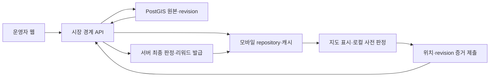

# 아키텍처

> 기준일: 2026-08-17

누리고는 대전 지역의 여러 전통시장을 우선 지원합니다. 현재는 하나의 Expo 앱에서 전통시장 경계 데이터를 제작하고 표시하지만, 장기적으로는 사용자 모바일 앱, 운영자 웹, API와 공통 패키지를 하나의 npm workspaces 모노레포에서 관리합니다.

## 현재 구조

```text
nurigo/
├─ README.md
├─ apps/api/                        # Spring Boot API, PostGIS migration과 OpenAPI 계약
│  └─ db/migrations/                # schema, 시장과 verified 경계 seed
├─ docs/
└─ mobile/                          # 현재 Expo 앱
   ├─ src/app/index.tsx             # 화면 조립
   └─ src/features/                 # 위치·HTTP 시장 repository·Polygon 편집
```

현재 모바일은 새 Polygon을 `MarketBoundaryDraftWriter`의 HTTP 구현으로 API와 PostGIS에 직접 저장하고, `MarketBoundaryRepository`의 HTTP 구현으로 verified 경계를 읽습니다. 대전중앙시장 revision 1은 Flyway V3가 PostGIS에 생성하며 앱 번들에는 시장 경계 JSON을 두지 않습니다. migration과 draft·verify·조회 흐름은 Testcontainers PostGIS에서 검증합니다.

## 목표 모노레포

```text
nurigo/
├─ apps/
│  ├─ mobile/          # 사용자 Expo 앱
│  ├─ admin/           # 시장·미션·보상 운영자 웹
│  └─ api/             # 인증, 진행도 검증, 리워드 발급 API
├─ packages/
│  ├─ contracts/       # 앱·관리자·API가 공유하는 타입과 계약
│  ├─ geo/             # Polygon 검증과 지오펜스 순수 로직
│  ├─ market-data/     # 공유 계약·어댑터·검증기·seed 도구
│  └─ config/          # 공통 TypeScript·Lint·빌드 설정
├─ docs/
└─ package.json        # npm workspaces 루트
```

현재 `mobile/`은 모노레포 전환 단계에서 `apps/mobile/`로 이동합니다. 이동 전후의 기능 동등성을 확인한 뒤 기존 경로를 제거하며, 문서화 작업에서는 빈 앱이나 패키지 디렉터리를 미리 만들지 않습니다.

## 구성 요소 책임

- **Mobile**: 위치 권한과 센서 접근, 시장 탐색, 미션 참여, 사용자 상태 표시. 현재 개발 빌드에는 경계 draft 제작 기능도 임시 포함
- **Admin**: 시장 구역, 미션, 보상 재고와 운영 상태 관리
- **API**: PostGIS 시장 경계 원본, revision 배포, 사용자 인증, 참여 증거 검증과 리워드 발급
- **Contracts**: 서비스 경계를 넘는 안정된 타입과 요청·응답 계약
- **Geo**: 플랫폼에 의존하지 않는 좌표·Polygon 검증과 내부·외부 판정
- **Market data**: GeoJSON wire type, 지도 어댑터, 검증기, fixture와 seed import 도구
- **Config**: 여러 앱과 패키지의 개발 도구 설정 일관성 유지

## 상위 데이터 흐름



모바일 앱은 사용자가 시장 안에 있는지 빠르게 안내할 수 있지만, 실제 미션 완료와 리워드 발급의 최종 권한은 API가 가집니다. 클라이언트 판정만으로 보상을 발급하지 않습니다.

## 현재 시장 경계 계약

```ts
type Coordinate = {
  latitude: number;
  longitude: number;
};

type MarketBoundary = {
  marketId: string;
  name: string;
  regionCode: string;
  revision: number;
  geometry: Polygon | MultiPolygon;
};
```

백엔드 PostGIS가 시장별 경계와 revision의 유일한 원본입니다. API는 RFC 7946 GeoJSON `[longitude, latitude]`를 반환하고 모바일 HTTP repository가 이를 `{ latitude, longitude }`와 Naver Map `Polygon | MultiPolygon` 형식으로 변환합니다. 세부 규격은 [시장 경계 데이터 관리](./MARKET_DATA.md)에 정의합니다.

## 다음 지오펜스 계약

`MarketBoundary`는 백엔드 API가 제공하고 모바일 repository가 앱 도메인 좌표로 변환한 `Polygon | MultiPolygon` 경계입니다.

```ts
isPointInMarket(
  point: Coordinate,
  boundary: MarketBoundary,
): boolean
```

- UI와 React Native에 의존하지 않는 순수 함수로 구현합니다.
- 경계선 또는 꼭짓점 위의 좌표는 시장 내부로 판정합니다.
- `Polygon`과 분리 구역이 있는 `MultiPolygon`을 동일한 계약으로 처리합니다.
- 정점이 부족하거나 숫자가 아닌 좌표를 포함한 경계는 안전하게 `false`를 반환합니다.
- 중심점, 명확한 외부점, 각 경계선, 꼭짓점과 잘못된 입력을 단위 테스트합니다.
- 모바일 앱의 로컬 판정 결과는 사용자 안내에 사용하고, 보상과 관련된 최종 판정은 API가 PostGIS `ST_Covers`로 재검증합니다.

## 미션과 리워드 경계

걸음 수, 구매, 친구 동반 방문은 향후 서로 다른 증거와 검증 규칙을 갖는 미션 종류입니다. 이 단계에서는 공통 개념과 책임만 정하고 상세 스키마는 확정하지 않습니다.

- **미션 정의**: 참여 조건, 유효 기간, 시장, 보상 연결
- **참여 증거**: 위치, 센서 기록, 구매 확인 또는 동반 방문 확인
- **진행도**: 사용자별 시작, 누적, 완료와 만료 상태
- **리워드 원장**: 발급 사유, 수량, 중복 방지와 사용 상태

세부 데이터베이스, 인증 방식, 부정 참여 방지 정책과 외부 보상 연동 방식은 해당 단계의 ADR에서 결정합니다.
